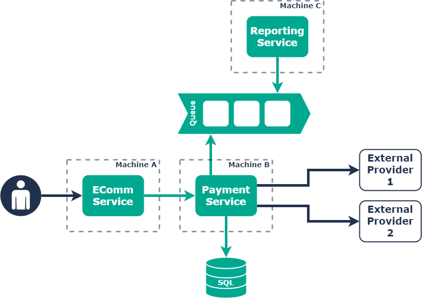

# Resiliency - Whiteboarding Test

## Introduction

Welcome to the Trainline Resiliency Whiteboarding test.

This will be a 45-60 minute exercise in which we will ask you to consider different scenarios associated to the system diagram below.

Please spend some time familiarising yourself with the diagram and context so that you are fully prepared on the day.

Good luck! 😃

---

## Context

What you are looking at is a simplified e-commerce and payments system.

Requests to fulfil an order are sent to the e-commerce service on Machine A. The E-Commerce service then issues a request to take payment via the Payment Service on Machine B. The Payment Service then talks to an external provider to take the payment. This request can be issued to either External Provider 1 or External Provider 2, but the Payments Service will be configured to route requests to External Provider 2 as the primary.

In addition, the Payment Service reports the payment processing outcomes to the Reporting Service on Machine C asynchronously via a queue.

## Diagram

